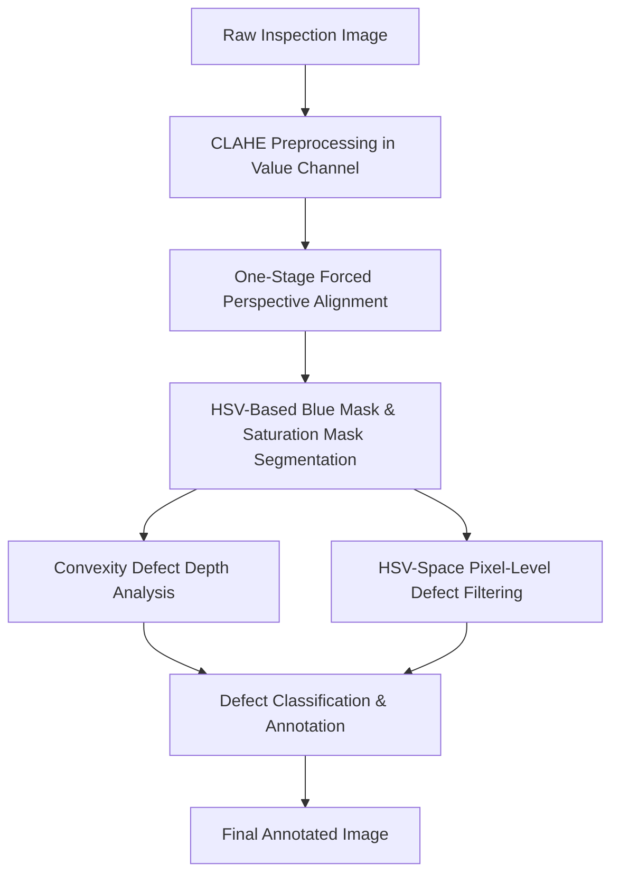

# Rubik's Cube Defect Inspection System

An automated computer vision inspection system designed to detect defects on a Rubik's Cube face using classical image processing techniques in OpenCV and Python. The system targets two distinct types of defects:
1. **Rotated Layers (Structural/Alignment defects)**: Misaligned layers relative to the face configuration.
2. **Cell/Sticker Defects (Surface/Color defects)**: Damaged, missing, or incorrect sticker colors, including cells covered with black tape.

---

## Project Architecture

The inspection pipeline consists of five key stages:



### 1. Preprocessing
To neutralize variable studio lighting and shadows, the raw RGB image is converted to the **HSV color space**. Contrast-Limited Adaptive Histogram Equalization (CLAHE) is applied exclusively to the **Value (V) channel** to enhance local contrast without distorting color information.

### 2. Registration & Alignment
Keypoint-based registration methods (like ORB or SIFT) are vulnerable to failure under highly scrambled color layouts. To address this, the system segments the front face (blue) and applies a **One-Stage Forced Perspective Warp** directly from the original image:
* An **aspect-ratio based filter** (`width / height`) in the unaligned coordinate space detects missing border rows/cols due to layer rotation.
* Shrunken bounding boxes are dynamically reconstructed (extended by $1.5\times$) to match the standard $3\times3$ grid dimensions.
* The warped face is mapped directly onto the reference grid template coordinates, eliminating ORB alignment cut-off errors.

### 3. Defect Analysis & Classification
* **Rotated Layers**: Flagged when an entire row/column in the grid contains less than $50.0\%$ blue pixels. The system boxes the rotated layer in **Green**.
* **Cell/Sticker Defects**: Handled via pixel-level HSV masking. A cell is flagged as defective if it contains $> 10\%$ non-blue saturated pixels or $> 20\%$ black tape pixels. Sticker defects are boxed in **Red**.

---

## File Structure

* `core_functions.py` - Core algorithmic library containing registration, preprocessing, and classification logic.
* `01_Preprocessing.ipynb` - Initial analysis of color spaces (RGB vs. HSV) and CLAHE contrast enhancement.
* `02_Registration_Research.ipynb` - Evaluation of SIFT, ORB, Affine, and Homography alignment models.
* `03_Defect_Analysis.ipynb` - Subtraction masking, convexity defects, and grid segmentation.
* `04_Final_Pipeline.ipynb` - Unified, automated pipeline running across both solved and scrambled datasets.
* `Final_Project_Rubiks_Cube_Report.docx` - The comprehensive English summary report detailing system architecture, edge case analysis, and performance.
* `data/` - Dataset directory containing solved and scrambled pipeline images.

---

## Quantitative Results & Validation

Tested over all 14 dataset images, the system performance metrics are summarized below:

| Image Filename | Pipeline Mode | Expected Defects | Detected Defects | TP | FP | FN |
| :--- | :--- | :--- | :--- | :---: | :---: | :---: |
| `inspect_solved_single_defect.jpg` | Solved | 1 Sticker Defect | 1 Sticker Defect | 1 | 0 | 0 |
| `inspect_solved_multi_defect_1.jpg` | Solved | 4 Sticker Defects | 4 Sticker Defects | 4 | 0 | 0 |
| `inspect_solved_multi_defect_2.jpg` | Solved | 2 Sticker Defects | 2 Sticker Defects | 2 | 0 | 0 |
| `inspect_solved_rotated_flat_layer.jpg` | Solved | 1 Sticker Defect | 1 Rotated Layer, 1 Sticker Defect | 1 | 1 | 0 |
| `inspect_solved_rotated_layer.jpg` | Solved | None | 1 Rotated Layer | 0 | 1 | 0 |
| `inspect_solved_rotated_layer_and_defect.jpg` | Solved | 1 Rotation, 1 Sticker | 1 Rotation, 1 Sticker | 2 | 0 | 0 |
| `inspect_scrambled_cell_defect.jpg` | Scrambled | 1 Sticker Defect | 1 Sticker Defect | 1 | 0 | 0 |
| `inspect_scrambled_perspective.jpg` | Scrambled | None | None | 0 | 0 | 0 |
| `inspect_scrambled_rotated_layer_and_defect.jpg` | Scrambled | 1 Rotation, 2 Stickers | 1 Rotation, 1 Sticker | 2 | 0 | 1 |
| `inspect_scrambled_rotated_layer_hard.jpg` | Scrambled | 1 Rotation | 1 Rotation | 1 | 0 | 0 |
| `inspect_scrambled_rotated_layer_soft.jpg` | Scrambled | 1 Rotation | 1 Rotation | 1 | 0 | 0 |
| `inspect_scrambled_rotated_layers.jpg` | Scrambled | 1 Rotation | 1 Rotation | 1 | 0 | 0 |
| `inspect_scrambled_shadow.jpg` | Scrambled | None | None | 0 | 0 | 0 |
| `inspect_scrambled_stress_test.jpg` | Scrambled | 1 Rotation, 3 Stickers | 3 Sticker Defects (misaligned) | 0 | 3 | 4 |
| **Total** | **-** | **21 Elements** | **21 Elements** | **16** | **5** | **5** |

---

## Failure Analysis & Limitations

1. **False Rotated Layers in Solved Cases** (`inspect_solved_rotated_flat_layer.jpg` & `inspect_solved_rotated_layer.jpg`): The cube is structurally solved (straight), but the top row consists of a different color. Because the blue mask was absent in the top row, the algorithm mathematically classified it as a rotated layer (1 FP).
2. **Missed Sticker Defects in Scrambled Combination** (`inspect_scrambled_rotated_layer_and_defect.jpg`): One of the two sticker defects was missed, demonstrating the limitation of simple color-thresholding under low-contrast scenarios (1 FN).
3. **Registration Failure under Extreme Scramble** (`inspect_scrambled_stress_test.jpg`): The high entropy of the scrambled layout prevented the ORB feature matcher from resolving the correct homography. Consequently, the grid alignment was offset, resulting in misaligned defect boxes (3 FP) and a missed rotated layer (1 FN).

---

## Setup & Execution

### Prerequisites
* Python 3.8+
* OpenCV (`opencv-python`)
* NumPy
* Matplotlib

### Running the Inspection Pipeline
1. Clone the repository:
   ```bash
   git clone https://github.com/NoamShaphir/Image-Process-Rubiks-Cube.git
   cd Image-Process-Rubiks-Cube
   ```
2. Open Jupyter Notebook:
   ```bash
   jupyter notebook
   ```
3. Open and run all cells in `04_Final_Pipeline.ipynb` to view the unified execution and logging.
